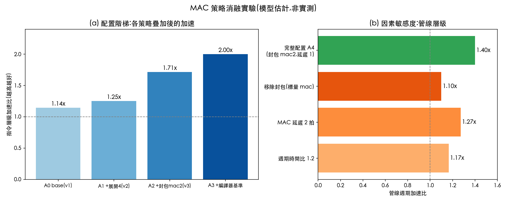

# mac_demo:MAC 自訂指令示範(整合版)

本資料夾整合了 v2 與 v3 的全部內容:`mac`(rd 累加器與 R4 形式)、`mac2`(封包雙 16-bit 乘加)、展開與主機計時實驗、時鐘模型、Amdahl 稀釋與編譯器基準。

## 版本目錄

| 版本 | 目錄 | 主要內容 |
|---|---|---|
| v2 | [`mac_demo_v2/`](mac_demo_v2/) | rd 累加器與 R4 形式、`rd = x0` 語意、溢位測試、展開迴圈、主機計時 |
| v3 | [`mac_demo_v3/`](mac_demo_v3/) | 封包雙 16-bit 乘加 `mac2`、INT16 benchmark |
| v4 | [`mac_demo_v4/`](mac_demo_v4/) | `mac2` 進入 pipeline 模型、部分積估計、編譯器基準、Amdahl、消融實驗 |

目前的整合版即本目錄(`mac_demo/`),內容與 v4 相同並包含其測試。

### 消融實驗圖



圖中數字為模型估計,不是實測。圖檔由 `mac_demo_v4/benchmark/plot_ablation.py` 產生,向量版本為 [`ablation.svg`](mac_demo_v4/figures/ablation.svg)。

---

## 一、新增內容

### 1.1 封包雙 16-bit 乘加 `mac2`

```
mac2 rd, rs1, rs2       rd = rd + lo16(rs1)×lo16(rs2) + hi16(rs1)×hi16(rs2)
```

- 16-bit 有號 lane,每個 32-bit 暫存器裝兩個 lane(`lo` 在 [15:0],`hi` 在 [31:16])
- 結果為 32-bit 有號整數,溢位回繞
- 編碼:R-type,custom-0(`0001011`),`funct3 = 2`,`funct7 = 0`
- 與 `mac`(`funct3 = 0`)、`mac4`(`funct3 = 1`,R4 形式)互不誤判,測試已涵蓋
- 在 ARM SMLAD 的形式中,累加器為 `Ra`;此處為 rd 累加,與 v2 的 `mac` 一致,因此仍需 3 個讀埠

### 1.2 INT16 benchmark(B4)

- 工作負載:N 個 32-bit 字(每字 2 個 int16),N ∈ {64, 256, 1024},即 128、512、2048 個 int16 元素
- 輸入由 seed `2026` 產生,結果以 int16 的參考點積比對

### 1.3 基準寫法的選擇

標準版有兩種合理寫法,會得到不同的加速比,因此兩者都列出:

| 基準 | 每字指令數(本體) | 說明 |
|---|---:|---|
| `std_lh`(強基準) | 8 | 四次 `lh` 直接載入 lane,兩次 `mul`,兩次 `add` |
| `std_lw`(弱基準) | 12 | 兩次 `lw`,以 `slli/srai` 取出 lane,兩次 `mul`,兩次 `add` |
| `mac2` | 3 | 兩次 `lw`,一次 `mac2` |

每字的迴圈開銷為 4 條(兩次指標遞增、計數遞減、`bnez`)。

## 二、檔案變更

| 檔案 | 變更 |
|---|---|
| `mac_encoding.py` | 新增 `encode_mac2`、`decode_mac2`、`mac2_golden` |
| `benchmark/packed.py` | 新增 `pack`、`make_int16_words`、`dot16_reference`、`packed_counts`、`run_packed_case`、`run_packed_all` |
| `benchmark/test_packed_bench.py` | 指令數與加速比測試 |
| `test_packed.py` | 編碼互斥、lane 語意、回繞、與參考結果一致 |
| `Makefile` | 新增 `make bench-packed` |

其餘檔案與 v2 相同。

## 三、執行方式

```bash
make test           # 全部測試(72 項)
make check-riscv    # RISC-V 組譯檢查(mac 指令)
make bench-packed   # INT16 封包 benchmark
make bench-unroll   # 展開 4 倍的 benchmark(v2)
make bench-latency  # MAC 延遲 1、2、3 拍(v2)
```

目前結果:**72 項測試全部通過**,RISC-V 組譯檢查通過。

## 四、運行效益結果(模型估計)

### 4.1 INT16 封包 benchmark(CPI = 1)

| 字數 N | 元素數 | T 比 | 標準 lh 指令數 | 標準 lw 指令數 | mac2 指令數 | 正確性 | 加速比(對 lh) | 加速比(對 lw) |
|---:|---:|---:|---:|---:|---:|:---:|---:|---:|
| 64 | 128 | 1.0 | 768 | 1024 | 448 | OK | 1.71x | 2.29x |
| 256 | 512 | 1.0 | 3072 | 4096 | 1792 | OK | 1.71x | 2.29x |
| 1024 | 2048 | 1.0 | 12288 | 16384 | 7168 | OK | 1.71x | 2.29x |
| 64 | 128 | 1.1 | 768 | 1024 | 448 | OK | 1.56x | 2.08x |
| 256 | 512 | 1.1 | 3072 | 4096 | 1792 | OK | 1.56x | 2.08x |
| 1024 | 2048 | 1.1 | 12288 | 16384 | 7168 | OK | 1.56x | 2.08x |
| 64 | 128 | 1.2 | 768 | 1024 | 448 | OK | 1.43x | 1.90x |
| 256 | 512 | 1.2 | 3072 | 4096 | 1792 | OK | 1.43x | 1.90x |
| 1024 | 2048 | 1.2 | 12288 | 16384 | 7168 | OK | 1.43x | 1.90x |

**解讀**
- 加速比與 N 無關,因為每字的指令數是固定的。
- 對強基準 `lh`,加速比為 12/7 ≈ 1.71;對弱基準 `lw`,為 16/7 ≈ 2.29。**同一條指令,基準不同,結論差很多**。報告時必須說明基準的選擇。
- 即使週期時間慢 20%(T 比 1.2),對強基準仍有 1.43 倍的加速。這比 v2 的單一 MAC(在 T 比 1.14 時即消失)更能容忍週期時間的增加。

### 4.2 比較 v2 的單一 MAC 與 v3 的 mac2(每個元素)

| 指令 | 每元素 IC(強基準) | 每元素 IC(mac 或 mac2) | 加速比 | 損益平衡 T 比 |
|---|---:|---:|---:|---:|
| `mac`(v2,INT32 元素) | 8 | 7 | 1.14x | 1.14 |
| `mac2`(v3,INT16 元素,2 個/字) | 6 | 3.5 | 1.71x | 1.71 |

封包化後,每條指令處理的元素數變為 2 倍,而迴圈開銷被攤提到 2 個元素上。

### 4.3 MAC 延遲(v2 的結果,v3 未延伸到 mac2)

| MAC 延遲 | 加速比(單一 mac,N = 1024) |
|---:|---:|
| 1 拍 | 1.10x |
| 2 拍 | 1.00x |
| 3 拍 | 0.92x |

`pipeline_model.py` 目前只有 `mac` 的延遲參數。把 `mac2` 放入 pipeline 模型的結果尚未計算,這是下一步工作。

## 五、與文獻建議的對照

| 建議(v2 第九節) | v3 的處理 |
|---|---|
| 報告 mac_lat = 1 與 2 兩種情境 | 已列出(第 4.3 節),`mac2` 的延遲情境尚未計算 |
| 加入封包化的 MAC 變體 | 已實作 `mac2`(雙 16-bit lane) |
| 與 RISC-V P 擴充的術語對齊 | 名稱仍為 `mac2`,與 P 擴充的正式命名不同,需於報告中說明 |
| 作業中引用 custom-0 規範原文 | 已在 v2 文件中說明,v3 未變更 |

## 六、限制

1. 所有加速比為模型估計,不是模擬器或 RTL 實測。
2. 基準寫法是手寫的,編譯器在 `-O2` 時可能產生不同的程式碼。
3. `mac2` 的硬體成本(兩個 16×16 乘法器加一個加法樹)未在模型中計入。
4. `mac2` 的 pipeline 延遲情境未計算。
5. 指令數以迴圈結構推算,未經 Spike 驗證。


## 十三、基準與 Amdahl 定律(依文獻整理)

文獻提出兩點與本示範直接相關的建議:

1. **基準應該是最佳化的程式**。手寫的迴圈不一定代表編譯器能產生的程式。我們以 `riscv64-elf-gcc -O2` 編譯 INT16 點積(`benchmark/dot16.c`),反組譯後量測迴圈本體:每個元素 7 條指令(`lh`、`lh`、`addi`、`addi`、`mul`、`add`、`bne`)。`-O3` 的結果相同,編譯器沒有展開這個迴圈。`make check-riscv` 與 `test_baseline_amdahl.py` 會重新編譯並驗證這個數字。
2. **整體加速要用 Amdahl 定律計算**。`overall = 1 / ((1 − f) + f / s)`,其中 f 是被加速的程式比例。

### 13.1 INT16 基準比較(每個元素)

| 基準 | 每元素指令數 | 對 `mac2`(3.5)的加速比 |
|---|---:|---:|
| 手寫 `lh`(強基準) | 6 | 1.71x |
| 編譯器 `-O2` | 7 | 2.00x |
| 手寫 `lw` + 符號擴展(弱基準) | 8 | 2.29x |

**解讀**:編譯器基準介於手寫的強基準與弱基準之間。報告時應以編譯器基準為主要結果,因為它是學生在實際工具鏈上會得到的程式。

### 13.2 Amdahl 稀釋(以強基準的 1.714x 為核心加速)

| 加速比例 f | 整體加速 |
|---:|---:|
| 1.00 | 1.714x |
| 0.80 | 1.500x |
| 0.50 | 1.263x |
| 0.25 | 1.116x |

**解讀**:同一條指令只在程式的一半時間內有用,整體加速就降到 1.26 倍。因此本示範的 benchmark 只量測點積核心,報告時必須說明這是核心加速,不是整個應用程式的加速。

## 十四、與 RISC-V P 擴充的命名對照

文獻顯示,P 擴充的封包乘加已有正式的指令形式:

- 基礎 P 擴充提供封包乘加(MACC),來源運算元最寬可達 32-bit,累加到 XLEN 或 2×XLEN 位元。
- 早期草案中的 `SMAQA` 已改名為 `PM4ADDA.B`,`SMAQA.SU` 改名為 `PM4ADDASU.B`。
- 我們的 `mac2` 對應的是雙 16-bit lane 的乘加形式,與 P 擴充中的雙 lane 版本概念相近,但**不是正式的 P 擴充指令**。報告時必須說明這一點,並使用 `mac2` 這個名稱,避免與正式命名混淆。

## 十五、整合版的限制(更新)

1. 編譯器基準只在指令數層級比較,未在模擬器上驗證執行結果。
2. Amdahl 的 f 是假設值,實際應用的比例需要剖析(profiling)才能得知。
3. `mac2` 不是正式的 RISC-V P 擴充指令。
